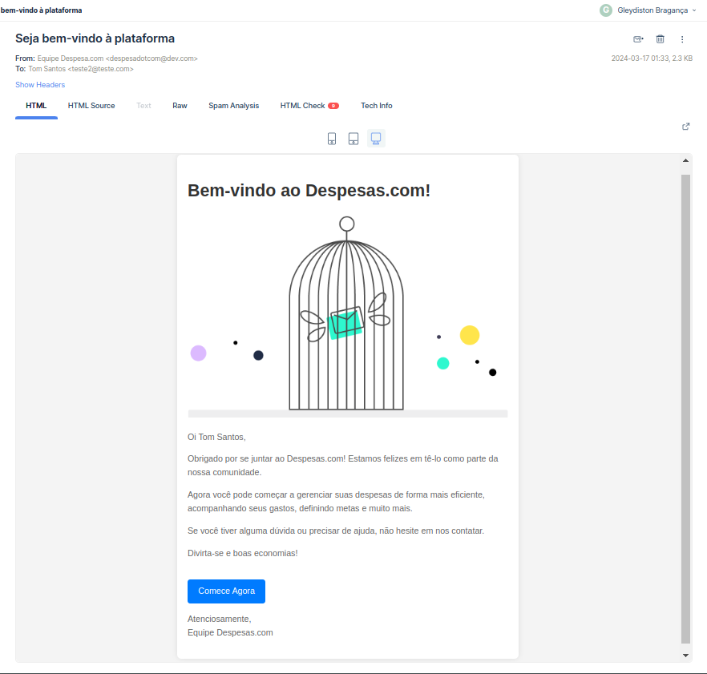
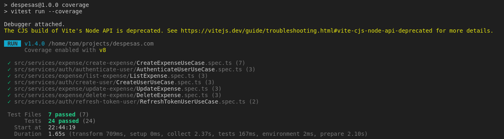

## Despesas.com - API REST Node.js 🚀

Este é um projeto que implementa uma API REST em Node.js para gerenciar despesas de usuários, com funcionalidades de autenticação de usuário, CRUD de despesas, validações de entrada e restrições de acesso.

### Uma breve introdução

Imaginemos que um usuário quer registrar seus gastos. Ele precisa de um aplicativo que ele possa se cadastrar, fazer login e registrae suas despesas diárias e visualiza-las. Neste contexto, o **despesa.com** seria a melhor ferramenta para ele.

🧾 - Minhas despesas diárias!

No caso, iremos criar toda a estrutura Back End para que isso ocorra.

Vamos lá!

### Tecnologias Utilizadas

- Node.js
- Express.js
- JWT (JSON Web Tokens) para autenticação
- Banco de dados (Prisma + MySQL)
- Nodemailer para envio de e-mails
<div style="display: inline_block">


</div>

### Instalação

1. Clone o repositório:

```bash
git clone https://github.com/seuusuario/despesas-com.git
```

2. Instale as dependências:

```bash
cd despesas.com
npm install
```

3. Configure as variáveis de ambiente:

Renomeie o arquivo .env.example para .env e configure as variáveis de ambiente necessárias, como a conexão com o banco de dados, segredo para geração de tokens JWT e credenciais para envio de e-mails.

4. Inicie o servidor:

```bash
npm run dev
```

A **rota root** do projeto é uma pagina que pode ser acessáda pelo navegador e contem informações sobre o projeto.
Para acessar clique **[AQUI](http://localhost:3333/)**.

Para testar sugiro dar uma lida na documentação do **[mailtrap.io](https://mailtrap.io/)**.

### Integrações

Como solicitado nos requisitos do teste, é enviado um email sempre que um novo usuário se cadastra ou cadastra uma nova despesa. Para testar, utilizei o mailtrap para simular uma caixa de entra e validar a integração.

<div style="width: 100%; display: flex; justify-content: space-evenly;">
  
</div>

### Rotas

#### Serviços de validação

GET /health: Valida a saude do serviço.  
GET /protected: Valida a saúde de uma rota protegida (para testes).

#### Serviços de authenticação

POST /signin: Registra um novo usuário.  
POST /login: Autentica um usuário e gera um token JWT.  
POST /refresh: Obter novos tokens para um usuário.

#### Serviços de despesas

POST /expense: Cria uma nova despesa para o usuário authenticado.  
GET /expense: Lista todas as despesas de um usuário autenticado.  
PUT /expense/{id}: Atualiza os valores de uma despesa .  
DELETE /expense{id}: Deleta uma despesa de um usuário.

### Testes

Este projeto possui testes unitários para validar a regra de negocio de cada um dos casos de usos apresentados.

Para executar os testes unitários execute:

```bash
npm run test
```

Além disso, você pode averiguar a cobertura dos arquivos atraves do coverage:

```bash
npm run coverage
```

Importante ressaltar que pelo pouco tempo para a execução do desafio, foi testado unicamente os serviços e as regras de negocio dos mesmos. Controllers e Providers não foram efetivamente testados, mas o processo de aperfeiçoamento continuará.



Para testar a API, você pode usar ferramentas como Postman ou Insomnia para enviar requisições HTTP para as rotas especificadas. Além disso, a API possui uma documentação própria que pode ser acessáda através da rota **[/api-docs](http://localhost:3333/api-docs/#)**.

### Considerações Finais

Este projeto foi desenvolvido como parte de um case técnico para demonstrar habilidades em Node.js, implementando boas práticas de desenvolvimento de software, como separação de responsabilidades, tratamento de erros e segurança e documentação de projeto. Qualquer feedback é bem-vindo para a melhoria contínua deste projeto.

### Resposavel

Gleydiston Bragança - gleydiston35@gmail.com

[](https://br.linkedin.com/in/gleydiston-santos-7245aa196)
[](https://github.com/tombraganca/tombraganca)
